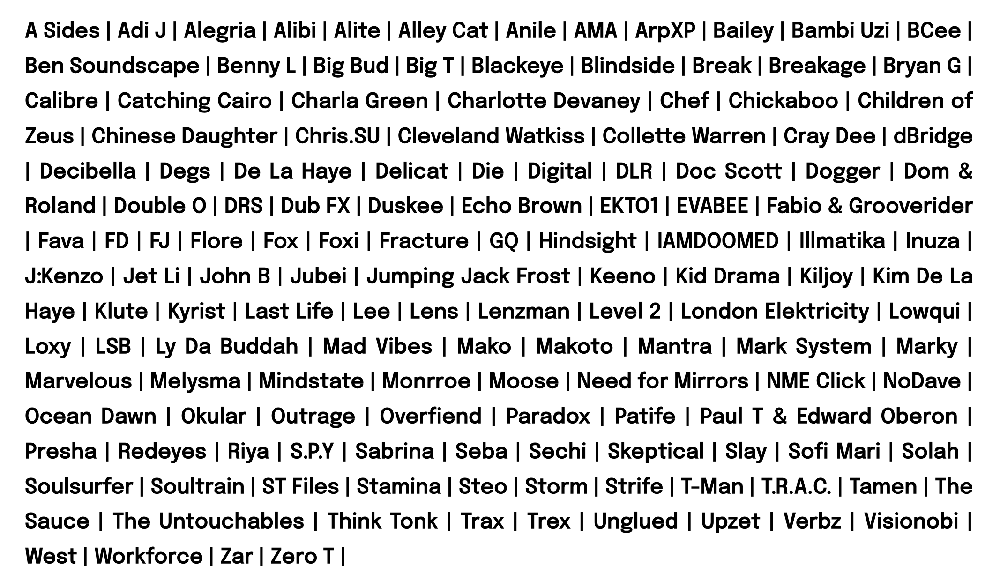
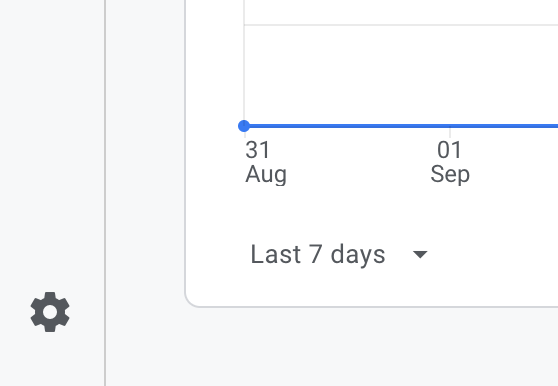
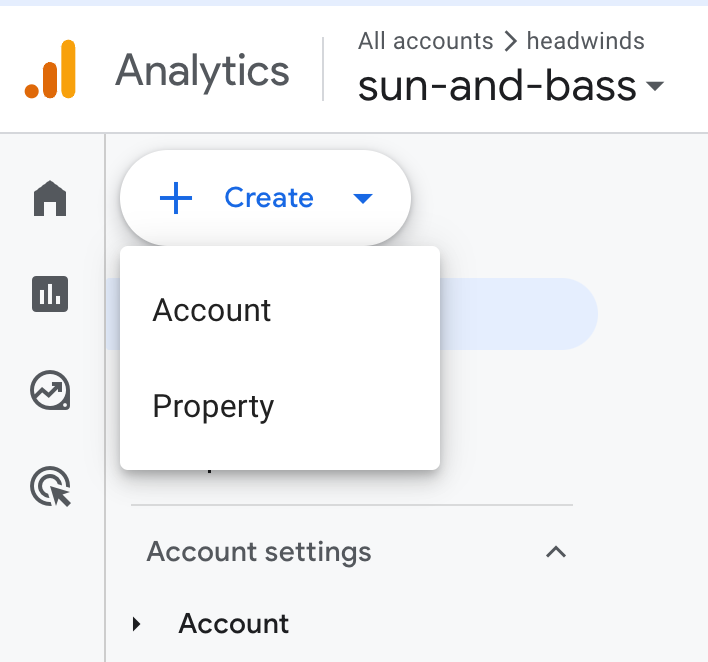

# sun and bass lineup 2024 challenge

 

After visiting the [sunandbass lineup](https://sunandbass.net/site/line-up-2024/) page, I wanted to see a rich line up artist gallery with photo, links and set times.

I have been experimenting with [v0](https://twitter.com/headwinds/status/1832081717135299043) and [perplexity labs](https://labs.perplexity.ai/) for rapid prototyping.

The grand vision would be able to see and track my friends as they experience the festival!

But for now, this is how far I got after a few hours of research; searching for artist info is labour of love but I still get tired after a while and spending any more than 5 minutes trying to get their photo to display really sucks the wind out...

### Demo

[sunandbass-lineup-2024.vercel.app](https://sunandbass-lineup-2024.vercel.app/)

### Install

- [pnpm](https://pnpm.io/)

```
pnpm i
pnpm dev
```

Library credits

- [radix](https://www.radix-ui.com/)
- [tailwindcss](https://tailwindcss.com/)
- [next](https://nextjs.org/)
- [react-world-flags](https://github.com/smucode/react-world-flags)
- [phosphor](https://www.npmjs.com/package/@phosphor-icons/react)

see [package.json](./package.json) for more

### Pain Points

Problem

why is it so challenging to find Artist photos? And why should I have to configure Next Image for a every url?

Potential Solution

There should be public press kit site for every artist which easy image urls for promoters.

Linktree might be close to this as it does provide press kit links.

#### Google Analytics

I dusted off my GA accounted and at first struggled to find the add new property button.

Ideally, it should have have been placed at the top where you view the properties but instead it's hidden within the admin gear at that the bottom on the screen.

1. click the Admin gear.
   

2. add the custom property (if you're new, you'll have to setup your account first)
   

Since this is nextjs, see my [app > layout.tsx](./app/layout.tsx) for the implementation which relies on [@next/third-parties/google](https://nextjs.org/docs/messages/next-script-for-ga#use-nextthird-parties-to-add-google-analyticsa)
